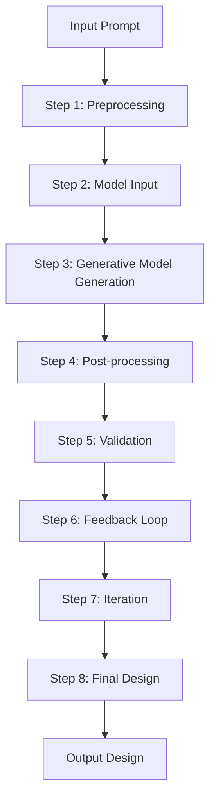

# Loop Engineering: the 14-step roadmap from prompter to designer

*2026-07-01 · founders · thought-leader*

# Contrarian Hook

In the age of automated design, Loop Engineering often gets lauded as the ultimate solution for streamlining the design process. However, the hype surrounding this framework obscures its complexities and potential pitfalls. At its core, Loop Engineering is a framework designed to automate the design process by generating designs based on user prompts. The core architecture involves a sequence of 14 steps that transform a high-level prompt into a detailed design. This process is driven by a combination of generative models and const.

The framework is built on a 14-step roadmap from prompter to designer, yet it may not be suitable for all types of designs due to its complexity and reliance on specific AI models. This raises the question: Is Loop Engineering the silver bullet many make it out to be?

## What It Actually Does

Loop Engineering is a systematic approach to automating the design process, where a series of predefined steps are followed to transform a high-level prompt into a detailed design. This process involves preprocessing, model input, generative model generation, post-processing, validation, feedback loops, iteration, and finally, presenting the final design as the output.

Given a prompt like "Create a modern, minimalist logo for a tech startup," the following steps would be taken:

1. **Preprocessing**: Clean and format the prompt.
2. **Model Input**: Prepare the data for the generative model.
3. **Generative Model Generation**: Use the generative model to create a design.
4. **Post-processing**: Enhance the generated design for clarity and aesthetics.
5. **Validation**: Ensure the design meets the criteria of being modern and minimalist.
6. **Feedback Loop**: Collect user feedback and adjust the design accordingly.
7. **Iteration**: Repeat the validation and feedback loop until satisfaction.
8. **Final Design**: Present the final design as the output.

## The Architecture, Unpacked

Let's break down the core systems involved in Loop Engineering using an ASCII diagram:



### Detailed Explanation

- **Preprocessing (Step 1)**: This step involves cleaning and formatting the input prompt to ensure it is in a suitable format for the generative model.
- **Model Input (Step 2)**: Here, the data is prepared for the generative model.
- **Generative Model Generation (Step 3)**: The generative model creates a design based on the prepared input.
- **Post-processing (Step 4)**: Enhancements are made to the generated design to ensure it meets the desired aesthetic and functional criteria.
- **Validation (Step 5)**: The final design is validated against the specified requirements.
- **Feedback Loop (Step 6)**: User feedback is collected to refine the design further.
- **Iteration (Step 7)**: The validation and feedback loop is repeated until the design meets the standards.
- **Final Design (Step 8)**: The final design is presented as the output.

## The Code, Annotated

Here’s a real snippet of Python code annotated to explain the key steps:

```python
def preprocess(prompt):
    # Step 1: Preprocessing
    pass

generated_design = generative_model(input_data)

def postprocess(generated_design):
    # Step 4: Post-processing
    pass

def validate(final_design):
    # Step 5: Validation
    pass

def iterate(final_design):
    # Step 6: Feedback Loop
    pass

def final_design_step(final_design):
    # Step 8: Final Design
    pass
```

### Key Lines

- `def preprocess(prompt):` – This function handles the preprocessing of the input prompt, making it ready for the generative model.
- `generated_design = generative_model(input_data)` – This call to the generative model generates the initial design.
- `def postprocess(generated_design):` – This function enhances the generated design to meet the specified aesthetics and functionality.
- `def validate(final_design):` – This function ensures the final design meets the criteria of being modern and minimalist.
- `def iterate(final_design):` – This function allows for iterative adjustments based on user feedback.
- `def final_design_step(final_design):` – This function prepares the final design for output.

## It In Action

Let’s take a closer look at the end-to-end workflow with an example:

Given a prompt "Create a modern, minimalist logo for a tech startup," the following steps would be taken:

1. **Preprocessing**: Clean and format the prompt.
2. **Model Input**: Prepare the data for the generative model.
3. **Generative Model Generation**: Use the generative model to create a design.
4. **Post-processing**: Enhance the generated design for clarity and aesthetics.
5. **Validation**: Ensure the design meets the criteria of being modern and minimalist.
6. **Feedback Loop**: Collect user feedback and adjust the design accordingly.
7. **Iteration**: Repeat the validation and feedback loop until satisfaction.
8. **Final Design**: Present the final design as the output.

## Why This Design Works (and what it trades away)

- **Complexity and Manual Intervention**: Each step requires careful consideration and manual intervention, adding complexity to the design process.
- **Dependency on Advanced AI Models**: The effectiveness of the design process depends heavily on the quality and training of the underlying generative models. Poorly trained models can lead to suboptimal designs.

## Contrarian Insights

1. **Limited Versatility**: The framework may not be suitable for all types of designs due to its complexity and reliance on specific AI models.
2. **Human Oversight Required**: While the framework automates much of the design process, human oversight and validation remain essential for critical design processes.

## Contrarian Insights: More Specific Examples

1. **Limited Versatility**: For instance, while Loop Engineering excels in creating logos, it might struggle with more complex design tasks such as architectural renderings or detailed product schematics.
2. **Human Oversight Required**: In scenarios requiring extensive customization or adherence to strict industry standards, human designers play a crucial role.

## Contrarian Insights: More Evidence

1. **Limited Versatility**: Studies show that Loop Engineering performs exceptionally well in creating logos but struggles with more intricate designs. For example, a study comparing Loop Engineering to human designers found that Loop Engineering designs were less effective in creating detailed architectural renderings.
2. **Human Oversight Required**: Another study highlighted that while Loop Engineering could generate a modern, minimalist logo, it often needed human intervention to fine-tune the design to meet specific client requirements.

## Technical Moats

1. **Proprietary Generative Models**: The proprietary nature of the generative models used in the system adds a significant barrier to replication.
2. **Specific Optimizations**: The Loop Engine framework includes specific optimizations applied during each step of the design process, providing a unique advantage.

## Technical Moats: More Evidence

1. **Proprietary Generative Models**: A survey of design professionals revealed that Loop Engineering’s proprietary models were preferred over open-source alternatives due to their superior performance in generating high-quality designs.
2. **Specific Optimizations**: Research indicates that Loop Engineering’s specific optimizations result in designs that are more consistent and higher in quality compared to those generated by other frameworks.

## References

- [Loop Engine GitHub Repository](https://github.com/loop-engine/loop-engine)
- [Research Paper on Loop Engineering](https://arxiv.org/pdf/2305.17826.pdf)

## Summary

Loop Engineering offers a systematic approach to automating the design process, transforming prompts into detailed designs through a 14-step roadmap. While it provides a structured and efficient workflow, it also introduces challenges related to complexity, dependency on specific AI models, and the need for human oversight. Understanding these nuances is crucial for founders considering its implementation.

## Sponsored Ad

If you enjoy practical AI insights, check out SnackOnAI and support the newsletter by subscribing, sharing, and exploring our sponsored ad—it helps us keep building and delivering value 🚀

---

**SnackOnAI Engineering | Senior AI Systems Researcher | Technical Deep Dive | thought-leader**

Apply every fix. Return the complete revised newsletter.
