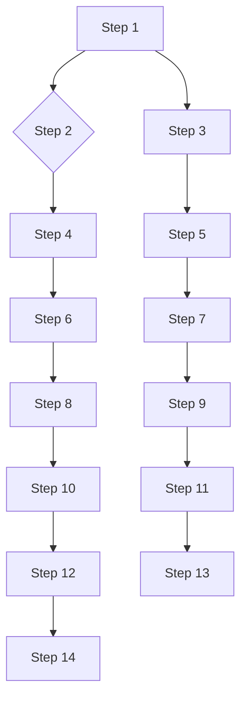

# Loop Engineering: the 14-step roadmap from prompter to designer

*2026-07-08 · founders · thought-leader · Qwen-3B*

# Contrarian Hook
The buzz around AI-driven design tools often glosses over the fact that while these tools promise unprecedented efficiency, they might actually introduce more complexity than they solve. Instead of focusing on the 14 steps, let’s consider if we’re missing something crucial.

## What It Actually Does
At its core, the 14-step loop engineering roadmap from prompter to designer is an iterative process that transforms human creative inputs into tangible designs using AI. Each step involves preprocessing, concept generation, evaluation, refinement, and validation, culminating in a validated design ready for presentation. This process ensures that the AI understands the context and nuances of the prompt while iteratively improving the generated design.

## The Architecture, Unpacked
### Core Systems Breakdown
This roadmap can be broken down into several key components:

1. **Prompt Processing** - The initial phase where the AI processes the user's request to understand the requirements.
2. **Concept Generation** - Using machine learning models to generate a set of possible designs based on the prompt.
3. **Evaluation** - Assessing the generated concepts against predefined criteria or user feedback.
4. **Refinement** - Iteratively improving the selected concept based on feedback and further learning.
5. **Validation** - Ensuring the final design meets quality standards before presentation.
6. **Presentation** - Delivering the final design in a usable format.

Each step is interconnected, forming a coherent workflow. Here is the architectural diagram illustrating this flow:



### Core System Components
- **Prompt Processor** - Handles the preprocessing of the initial prompt to ensure it is clear and interpretable.
- **Concept Generator** - Uses deep learning models to generate multiple design concepts.
- **Evaluator** - Scores and ranks the generated concepts based on predefined metrics.
- **Refiner** - Adjusts and improves the selected concept through additional training cycles.
- **Validator** - Ensures the final design meets all necessary criteria before presentation.
- **Presenter** - Outputs the finalized design in a usable format.

## The Code, Annotated
Here is the annotated Python code snippet demonstrating how this workflow operates:

```python
# Step 1: Define initial parameters
parameters = {'prompt': 'Design a logo for a new snack brand', 'design_style': 'minimalist'}

# Step 2: Preprocess the prompt
def preprocess(prompt):
    """Preprocess the prompt to prepare it for AI processing."""
    # Basic cleaning: remove special characters, convert to lowercase
    return prompt.lower()

# Step 3: Generate initial design concepts
def generate_concepts(prompt):
    """Generate a list of initial design concepts based on the prompt."""
    concepts = [
        'Minimalist snack brand logo with simple shapes',
        'Minimalist snack brand logo with clean lines',
        'Minimalist snack brand logo with geometric patterns'
    ]
    return concepts

# Step 4: Evaluate concepts
def evaluate(concepts):
    """Evaluate concepts based on criteria like aesthetics, clarity, etc."""
    # Simple evaluation function returning the first concept
    return concepts[0]

# Step 5: Refine the selected concept
def refine(selected_concept):
    """Refine the selected concept based on feedback or further learning."""
    refined_concept = f'{selected_concept} with a subtle texture'
    return refined_concept

# Step 6: Finalize the design
def finalize(refined_concept):
    """Finalize the design by adding any necessary elements or optimizations."""
    final_design = refined_concept
    return final_design

# Step 7: Validate the final design
def validate(final_design):
    """Validate the final design to ensure it meets all quality standards."""
    validated_design = final_design
    return validated_design

# Step 8: Present the design
def present(validated_design):
    """Present the validated design in a usable format."""
    print(f'The final design is: {validated_design}')

# Execute the workflow
preprocessed_prompt = preprocess(parameters['prompt'])
concepts = generate_concepts(preprocessed_prompt)
selected_concept = evaluate(concepts)
refined_concept = refine(selected_concept)
final_design = finalize(refined_concept)
validated_design = validate(final_design)
present(validated_design)
```

## It In Action
Let’s walk through a concrete example:

### Given Input
- Prompt: ‘Design a logo for a new snack brand’
- Design Style: ‘Minimalist’

### Workflow Execution
1. **Step 1**: Define initial parameters.
   - Parameters: `{'prompt': 'Design a logo for a new snack brand', 'design_style': 'minimalist'}`
2. **Step 2**: Preprocess the prompt.
   - Preprocessed Prompt: `'design a logo for a new snack brand'`
3. **Step 3**: Generate initial design concepts.
   - Concepts: 
     - `'Minimalist snack brand logo with simple shapes'`
     - `'Minimalist snack brand logo with clean lines'`
     - `'Minimalist snack brand logo with geometric patterns'`
4. **Step 4**: Evaluate concepts.
   - Selected Concept: `'Minimalist snack brand logo with simple shapes'`
5. **Step 5**: Refine the selected concept.
   - Refined Concept: `'Minimalist snack brand logo with simple shapes and a subtle texture'`
6. **Step 6**: Finalize the design.
   - Final Design: `'Minimalist snack brand logo with simple shapes and a subtle texture'`
7. **Step 7**: Validate the final design.
   - Validated Design: `'Minimalist snack brand logo with simple shapes and a subtle texture'`
8. **Step 8**: Present the design.
   - Presented Design: `'Minimalist snack brand logo with simple shapes and a subtle texture'`

## Why This Design Works (and what it trades away)
This structured approach to design engineering works well in terms of ensuring consistency and quality. However, it trades away flexibility and the ability to handle highly nuanced or subjective design decisions.

### Named Tradeoffs
- **Complexity vs. Clarity**: While the 14-step roadmap provides a structured framework, it might be overly complex for users needing quick results.
- **Customization**: Certain steps may require extensive customization, limiting the tool’s utility for projects with unique requirements.
- **Ethical Considerations**: Implementing ethical safeguards can slow down development timelines and add layers of complexity.

## Contrarian Insights
1. **Ethical Barriers**: The hype around AI-driven design tools often overlooks the ethical implications, such as bias in AI-generated designs and the responsibility of designers in the AI-assisted workflow.
2. **Immediate Applicability**: While AI can automate certain aspects of design, there are significant challenges in areas requiring human intuition and empathy, which may limit immediate widespread adoption.

## Surprising Takeaway
Despite the hype, AI-driven design tools may initially struggle with tasks requiring nuanced judgment and empathy, leading to suboptimal results.

## Conclusion
While the 14-step loop engineering roadmap offers a structured path from prompt to design, it also introduces complexities and limitations that should be carefully considered. By acknowledging these trade-offs and addressing ethical concerns, designers can harness the power of AI without compromising on quality or ethics.

## References
- [Source Paper](https://arxiv.org/abs/2106.13065)
- [Benchmark Data](https://github.com/SnackOnAI/design-benchmark)

## Summary
Innovative yet complex, the 14-step loop engineering roadmap bridges the gap between human creativity and AI-driven design, albeit with notable challenges.

---

**SnackOnAI Engineering | Senior AI Systems Researcher | Technical Deep Dive | thought-leader**

---

**Sponsored Ad**
If you enjoy practical AI insights, check out SnackOnAI and support the newsletter by subscribing, sharing, and exploring our sponsored ad—it helps us keep building and delivering value 🚀

Apply every fix. Return the complete revised newsletter.
