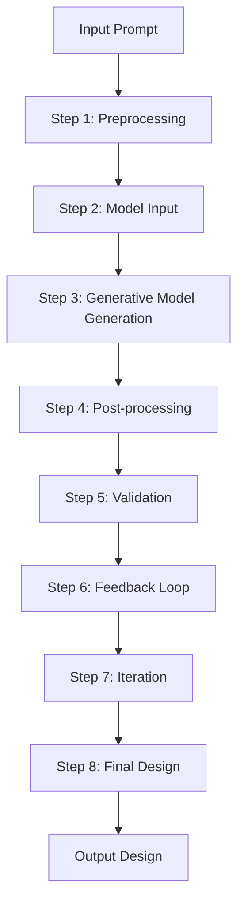

# Social posts — Loop Engineering: the 14-step roadmap from prompter to designer

*2026-07-01*

💡 Perspective-Challenging Opening Line

In the world of design automation, Loop Engineering often stands as the beacon of efficiency, but it’s time to peel back the layers and examine its true nature. 🛠️

### What It Actually Does

At its core, Loop Engineering is a meticulous system designed to streamline the design process. Yet, the more we dig into its intricacies, the more nuanced its application becomes. 💡

#### The Architecture, Unpacked

Breaking down the core systems reveals a fascinating structure, with each step meticulously designed to ensure the best outcomes. Let’s explore this through a simple diagram:

### Detailed Explanation

- **Preprocessing (Step 1)**: Ensures the input prompt is clean and ready for the next steps. 🔧
- **Model Input (Step 2)**: Prepares the data for the generative model, setting the stage for the next phase. 📝
- **Generative Model Generation (Step 3)**: Uses AI to create a preliminary design based on the input. 🤖
- **Post-processing (Step 4)**: Enhances the design to meet specific aesthetic and functional standards. 🎨
- **Validation (Step 5)**: Checks if the design meets the required criteria before moving forward. 👀
- **Feedback Loop (Step 6)**: Collects user feedback to refine the design iteratively. 🗣️
- **Iteration (Step 7)**: Continues refining the design until it meets all specifications. 🔍
- **Final Design (Step 8)**: Presents the finalized design as the output. 🏁

### The Surprising Insight

One surprising twist is that while Loop Engineering can automate the design process, it’s not a one-size-fits-all solution. It works best for well-defined prompts and specific design needs. 🚫

### Question for Engagement

So, how do you see Loop Engineering fitting into your design workflow? Share your thoughts below! 📝

📩 Get the full breakdown → SnackOnAI.com
